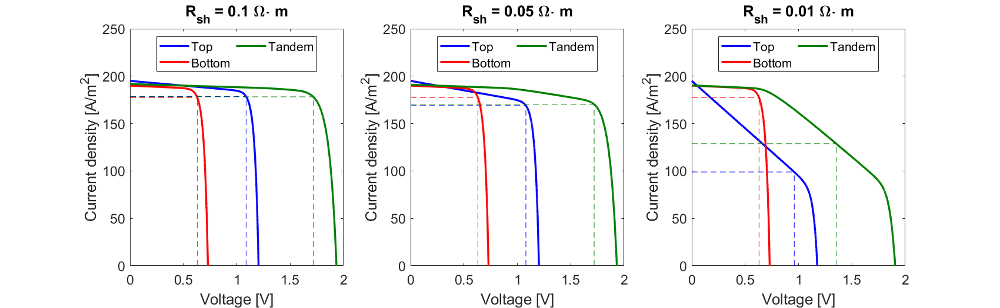
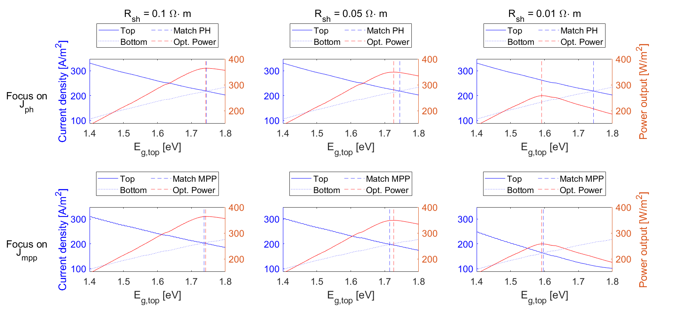

# Current matching in two-terminal solar cells
Multi-junction devices are a promising route of further increasing the conversion efficiency of solar cells, and thereby reducing the levelized cost of electricity for photovoltaic systems.
These so-called tandem devices come in three different architectures; two-terminal, three-terminal, and four-terminal.
Each architecture comes with its own advantages and disadvantages[1], but at the moment of writing (and to the best of the author's knowledge), two-terminal are the most promising, primarily due to demonstrated efficiencies and their similarity with conventional single-junction solar cells in both fabrication and module integration.

Two-terminal tandems, however, come with one big design constraint: current matching.
As the subcells are connected in series, the same current needs to flow in the top and bottom cell at all times.
This means that the tandem cell should be designed in such a way that the performance is maximum when both cells operate at the same current.
This design requirement is often interpreted as the requirement that both cells should have the same current absorption.
Various optical studies focus on the absorbed current in both subcells and aim to maximize the lowest value of absorbed current.
And although this is a good general approach, it is important to realize that matching current absorptions is only an approximation of the actual design requirement: Matching the maximum power point current of both cells.

When both subcells have a sufficiently large fill factor (FF), the maximum power point current ($I_{mpp}$) is approximately the same as the photogenerated current ($I_{ph}$), and therefore, matching $J_{ph}$ is sufficient.
However, when the FF of one subcell is low, this does not hold anymore.
As shown in the figure below, when the shunt resistanace ($R_{shunt}$) decreases, the two subcells remain a similar value of $J_{ph}$ (as it is similar to the short-circuit current), but the $J_{mpp}$ starts to differ.

## References
[1] Y. Blom, W. Suprayogi, M. Ruben Vogt, O. Isabella, and R. Santbergen, *Comparison on Module Performance and Degradation Robustness of Two-, Three-, and Four-Terminal Perovskite Silicon Configurations Under Realistic Operating Conditions*, Progress in Photovoltaics: Research and Applications 34, **6** (2026): 653–666, https://doi.org/10.1002/pip.70066.
